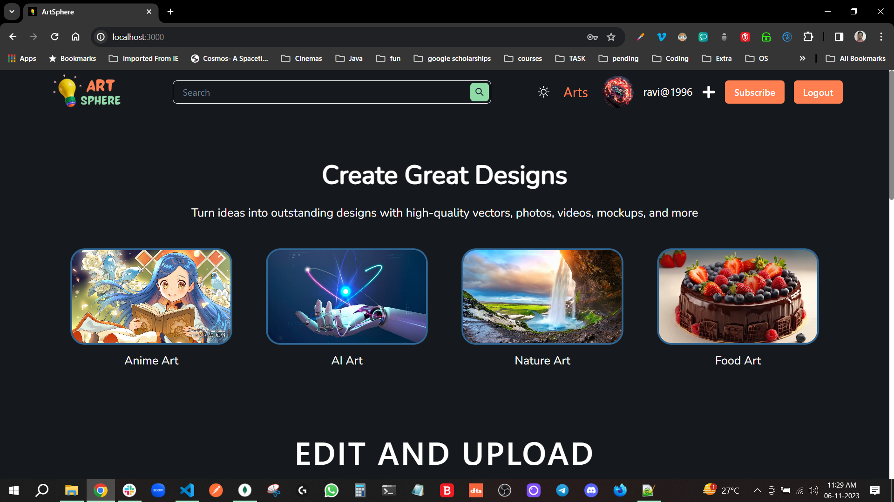
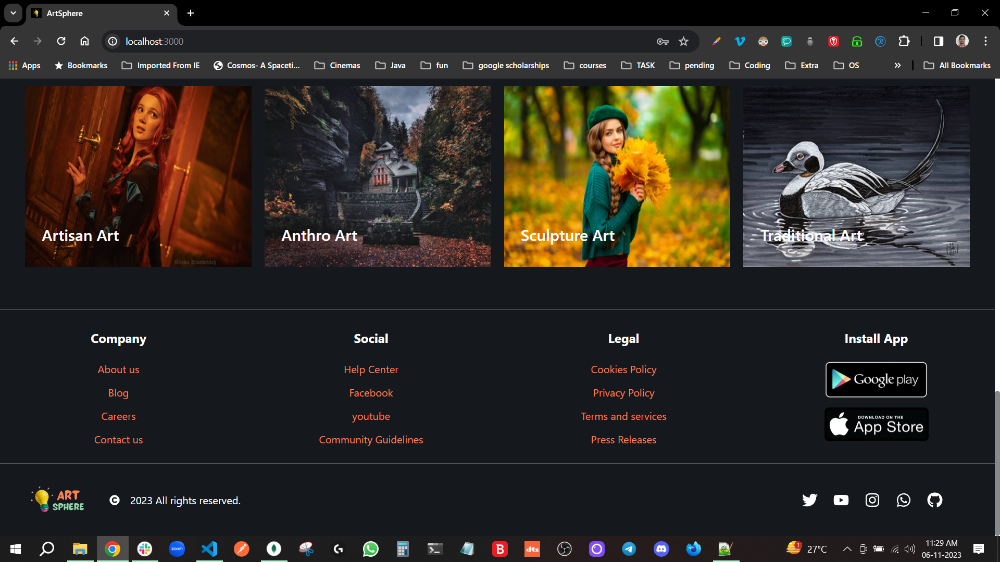
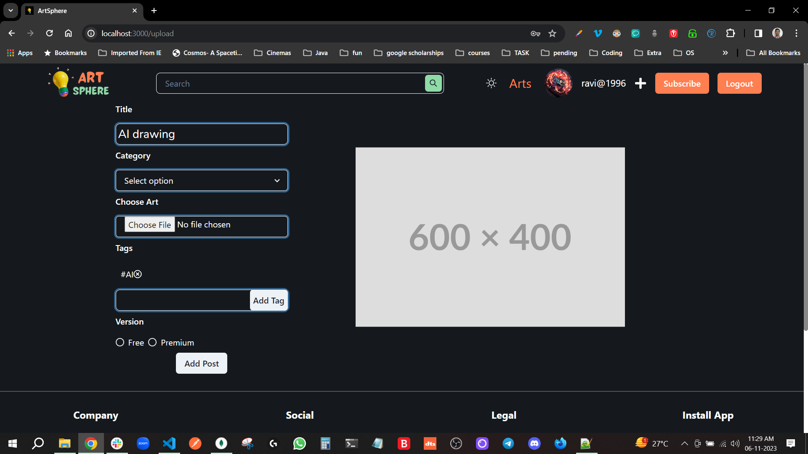
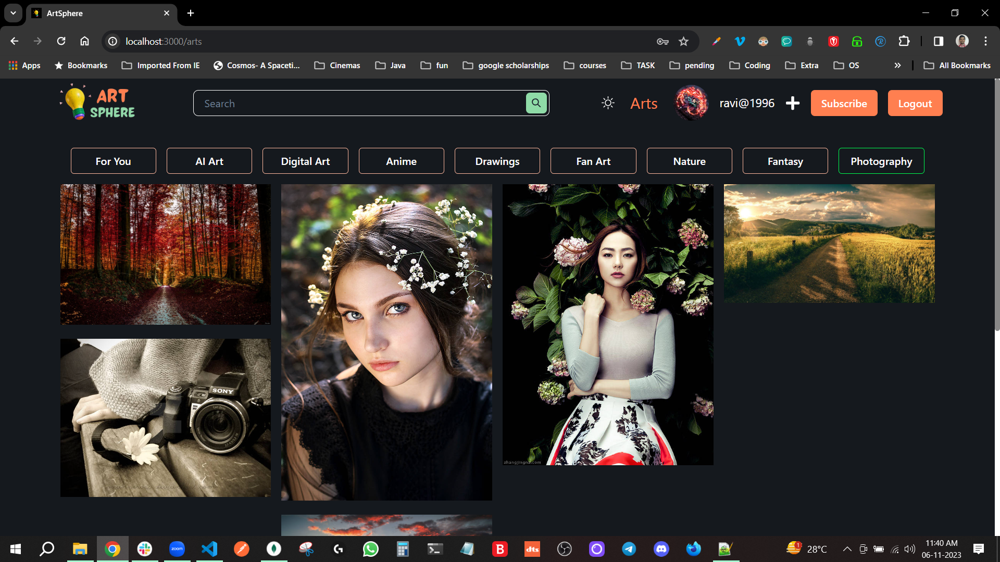
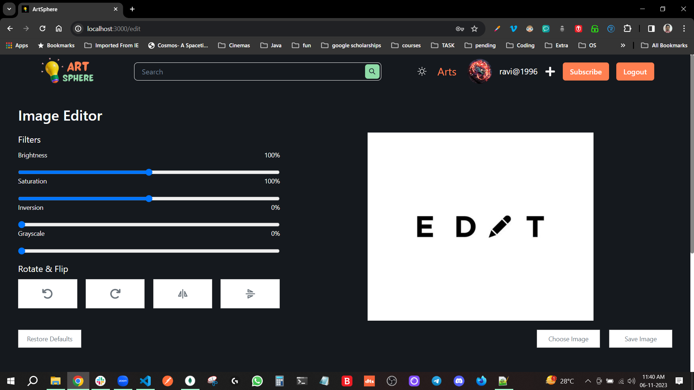
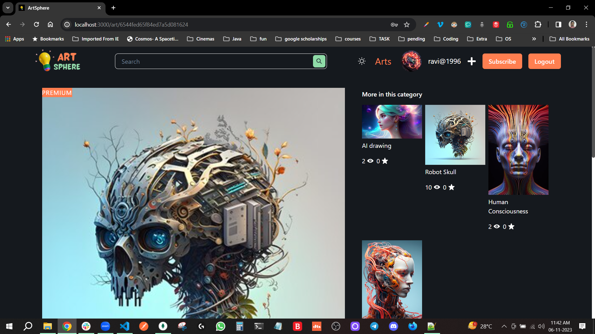
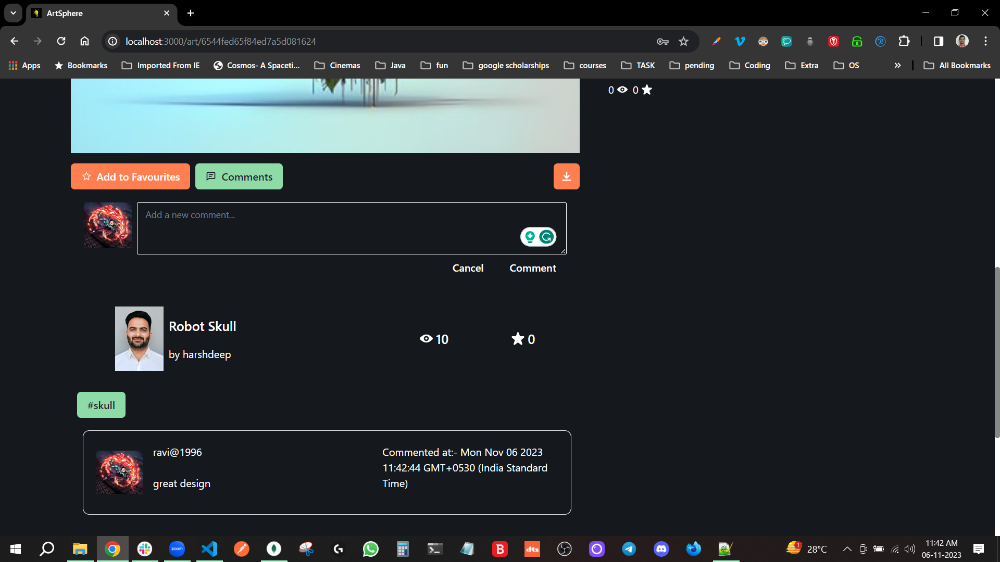

# ART SPHERE

Tag line : Turn ideas into outstanding designs with high-quality vectors, photos, videos, mockups, and more.

## Table of Contents

## [Description](#description)

- This is a React website built on theme of Art gallery it consists basic functionality such as post art, comment on art, view arts by category, etc more focus is on UI the project contains Home page, Arts page, Upload Page, Edit Art Page, Register Page and Login Page.

## [Features](#features)

1. Login and Register functionality.
2. Edit art through Image editor.
3. Post art and comment art functionality.
4. private route for single art page.
5. category filter functionality.
6. Search functionality with debouncing.
7. Great Home page and Art page designs.
8. Website is fully responsive.
9. Uses MongoDb to store all data and express js for server functionality.

## Tech Stack

1. React JS with React-Redux.
2. Chakra UI.
3. styled components.
4. Framer Motion.
5. Mongo DB.
6. Mongoose.
7. Express JS.
8. Firebase.

## [Screenshots](#screenshots)










## Installation

1. Clone the repository:

   ```sh
   git clone https://github.com/harshdeepgill/festive-crayon-1023.git
   ```

2. navigate to project folder:

   ```sh
   cd frontend
   ```

3. install the required dependencies:

   ```sh
   npm install
   ```

4. start the frontend server:

   ```sh
   npm run start
   ```

## Usage

1. After following the installation steps, open your web browser.
2. Navigate to <http://localhost:3000> to access the website.
3. Explore the different features and sections of the website.
4. Interact with the elements and see the content.
5. Enjoy using the website and provide feedback!

## Contributing

Contributions are welcome! Here's how you can get involved:

1. Fork the repository.
2. Create a new branch for your feature or bug fix:

   ```sh
   git checkout -b feature-name
   ```

3. Make your changes and commit them:

   ```sh
   git commit -m "Add your message here"
   ```

4. Push your changes to your forked repository:

   ```sh
   git push origin feature-name
   ```

5. Open a pull request on GitHub and provide details about your changes.

## Production Links

[cyclic deployed Backend](https://artsphere.onrender.com/)

[vercel deployed frontend](https://festive-crayon-1023-one.vercel.app/)
